&nbsp;

<!--  -->

**ML × security** out of Mumbai. I build LLM agents that test access control, 
honeypots that learn from whoever attacks them, and transformers that un-break images.

 

  
  
  
  
  
  

<picture>
  <source media="(prefers-color-scheme: dark)" srcset="https://raw.githubusercontent.com/Bladekiller246/Bladekiller246/output/snake-dark.svg">
  <source media="(prefers-color-scheme: light)" srcset="https://raw.githubusercontent.com/Bladekiller246/Bladekiller246/output/snake-light.svg">
  
</picture>

  

